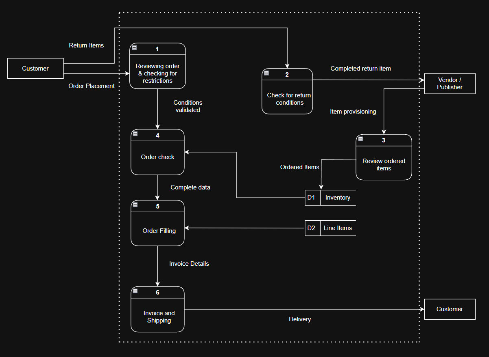

# 🏢 Enterprise System Design and Business Process Optimization

This project presents a full-scale business systems analysis and redesign for a mid-sized organization in the retail business. The goal was to improve operational efficiency and scalability by designing a new integrated information system.

## 🧠 Project Overview

The redesigned system addresses key business areas such as order processing, inventory control, vendor management, returns handling, and financial reporting. The project includes detailed requirements gathering, process modeling, and design of both data and system architectures.

## 📊 System Overview Diagram

Below is the Level 0 Data Flow Diagram (DFD), which illustrates how core functions interact with external entities and data stores in the proposed system:

## 🛠 Key Deliverables

- 📋 Business Requirements Documentation  
- 🔄 Structured Analysis: Context and Level-0 Data Flow Diagrams (DFDs)  
- 🧩 Entity Relationship Diagrams (ERDs)  
- ⚙️ Object-Oriented Models: Use Case, Class, Sequence, and State Diagrams  

## 🔧 Tools and Techniques

- Business Process Modeling  
- UML and Structured Modeling (Visio / Lucidchart)  
- Functional and Non-Functional Requirements Analysis  
- System Scalability and Security Planning  

## 💼 Skills Showcased

- Business Systems Analysis  
- Requirements Gathering & Documentation  
- System Design (Structured & OO)  
- Stakeholder Communication  
- Strategic Thinking in IT Enablement  

---

## 🙏 Acknowledgment

This project was completed as part of an academic course on Information Systems Analysis and reflects collaborative work focused on real-world system design methodologies.
